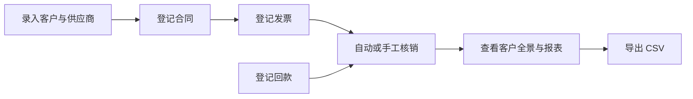

<h1 align="center">Finledger · 财会助手</h1>

<p align="center"><strong>把客户、合同、发票和回款放进同一套台账，完成核销，并查看应收与合同执行情况。</strong></p>

<p align="center">
  
  
  
</p>

一个使用 Streamlit 构建的内部财务台账工具，通过六张业务表管理客户/供应商、合同、发票、回款、核销记录和参数。数据存入本地 SQLite，界面提供录入、修改、批量导入和 CSV 导出。

“核销”是把一笔回款与对应发票匹配，记录已经冲抵的金额。项目提供先进先出、手工指定和撤销核销，帮助使用者追踪哪些款项尚未收齐、哪些发票尚未核销。

当前登录使用共享访问密码，操作人名称可填写。多人使用时不具备独立账号或角色权限隔离，审计日志中的操作人也不能当作经过独立身份认证的凭据。

## 📊 工作流程



## ✨ 功能特性

| 能力 | 说明 |
| --- | --- |
| 业务台账 | 管理往来单位、合同、发票和回款，支持新增、修改与删除校验 |
| 三种导入格式 | CSV、Excel `.xlsx`、Word `.docx`，导入前进行校验与预览 |
| 核销处理 | 先进先出、手工指定发票、撤销已记录的核销 |
| 业务约束 | 重复发票、红冲、作废、已核销金额修改等检查 |
| 客户全景 | 汇总查看客户相关合同、发票与回款情况 |
| 经营报表 | 应收未回款、合同执行进度、开票未核销，支持 CSV 导出 |
| 操作记录 | 保存操作类型、填写的操作人、时间和变更前后内容 |
| 访问密码 | 支持 PBKDF2-SHA256 密码哈希，未配置任何密码时拒绝启动 |

## 🧱 技术栈

| 层 | 技术 |
| --- | --- |
| 网页界面 | Python、Streamlit |
| 数据处理 | pandas |
| 持久化 | SQLite，默认 `finledger.db` |
| 文件解析 | CSV 标准库、openpyxl、python-docx |
| 密码校验 | Python 标准库 hashlib / secrets |
| 测试 | pytest、Streamlit AppTest |

## 📁 目录结构

```
finledger/
  app.py            # Streamlit 内网 Web 界面（入口）
  auth.py           # 访问密码加载与校验
  password_tool.py  # 交互式生成密码哈希
  db.py             # SQLite 数据层：六表 + 审计日志 + 默认参数
  rules.py          # 业务规则引擎：金额勾稽 / 方向校验 / 回款状态推导
  writeoff.py       # 核销引擎：先进先出 / 手工指定 / 撤销
  import_export.py  # 导入导出：CSV / Excel(.xlsx) / Word(.docx)，表头校验 + 编号自动生成
  knowledge/
    schema.md       # 六张表字段说明
    rules.md        # 业务规则说明
  requirements.txt
```

## 🚀 快速开始

以下命令适用于 macOS / Linux，需要 Git 与 Python 3，依赖以 [requirements.txt](requirements.txt) 为准。

### 1. 下载并安装

```bash
git clone https://github.com/RoourChen/finledger.git
cd finledger
python3 -m venv .venv
.venv/bin/pip install -r requirements.txt
```

### 2. 配置访问密码

运行交互式工具，按提示输入两次密码，输入不会回显。

```bash
.venv/bin/python password_tool.py
cp .env.example .env
chmod 600 .env
```

用编辑器打开 `.env`，将工具生成的完整 `FINLEDGER_PASSWORD_HASH='...'` 配置行填入。保留单引号，避免哈希中的 `$` 被 shell 解释。已有 `.env` 时直接编辑，避免重新复制覆盖原配置。

不要把密码或生成的哈希直接粘贴成终端命令，以免进入 shell 历史；`.env` 已被 Git 忽略，也不要手动提交。

### 3. 加载配置并启动

```bash
set -a
source .env
set +a
.venv/bin/streamlit run app.py --server.address 127.0.0.1
```

访问 [http://127.0.0.1:8501](http://127.0.0.1:8501)，输入刚才设置的访问密码。登录后先录入客户/供应商，再录入关联的合同、发票和回款。上面的命令只允许本机访问，开放到内网前应明确访问范围。

**`.env` 只能由可信人员维护，并保持 `chmod 600` 权限。** `source .env` 会将其内容作为 shell 脚本执行，不能加载来源不明的文件。Streamlit 不会自动读取此项目的 `.env`，因此启动前需要加载配置。

## ⚙️ 配置

| 环境变量 | 用途 | 默认或要求 |
| --- | --- | --- |
| `FINLEDGER_PASSWORD_HASH` | 访问密码哈希 | 正式使用应配置，通过 `password_tool.py` 生成 |
| `FINLEDGER_PASSWORD` | 临时明文密码 | 仅限本地开发，会产生警告；哈希配置优先 |
| `FINLEDGER_OPERATOR` | 操作人默认名称 | `admin`，可在侧边栏临时修改 |
| `FINLEDGER_DB` | SQLite 文件位置 | `finledger.db` |

两个密码变量都为空时应用拒绝启动。程序不会自动区分开发与生产环境，正式使用时请保留哈希配置并清除明文密码。

数据库与导出文件包含业务资料，应存放在受控位置并制定备份方式。SQLite 适合此项目的轻量内部使用，不能据此推断已经支持高并发、多实例部署或完整企业财务权限体系。

## 📋 核心约束（已内建）

| 约束 | 位置 |
|---|---|
| 发票 `(发票代码, 发票号码)` 唯一，防重复录入 | `db.py` invoices 表 `UNIQUE` |
| 核销 `(回款单号, 发票编号)` 唯一，防重复核销 | `db.py` writeoffs 表 `UNIQUE` |
| 审计日志：操作类型/操作人/时间/变更前后数据 | `db.py` audit_log + `audit()` |
| 参数表默认值：默认税率 13%、核销规则 先进先出 | `db.py` `DEFAULT_PARAMS` + `init_db()` |
| 回款「状态」不落库，由核销记录自动推导 | `writeoff.py` `writeoff_status()` |

## 📥 导入与导出

- **批量导入**：每张台账页底部有「批量导入」，支持 **CSV / Excel(.xlsx) / Word(.docx)** 三种格式。
  - 自动识别表头行（可跳过标题行/空行）；一个 sheet/文档里纵向堆叠多张表时自动按「表X：…」标题拆分，可下拉选择。
  - 表头支持英文列名/中文名/常见别名（如「编号」「纳税人识别号」「合同金额（含税）」），全角半角括号自动归一。
  - 税率自动归一为百分比（0.13 → 13%），Excel 日期序列号自动转 YYYY-MM-DD。
  - ★ 为必填列、其余缺省自动填默认值；上传后先校验并预览前 5 行；「编号」列留空会自动生成（KH001 / HT001 / FP001 / HK001）。
- **报表导出**：「报表」页三张报表（应收未回款 / 合同执行进度 / 开票未核销）均可一键导出 CSV。
- **台账导出**：每张台账页右上可导出当前表为 CSV。

## 🧪 运行测试

```bash
.venv/bin/pip install -r requirements-dev.txt
.venv/bin/python -m pytest tests/ -v
```

测试覆盖（财务准确性底线，回归必跑）：
- 建库与初始化：六表 + 参数默认值 + 审计日志（操作类型/操作人/时间/变更前后）
- 业务规则：红冲联动减少可核销金额、红字/作废不可核销、回款状态自动推导
- 数据完整性：发票代码+号码唯一、核销（回款+发票）唯一、税号/合同/回款编号唯一
- 修改金额校验：已关联核销的发票/回款金额不允许改小，需先撤销核销
- UI 冒烟（AppTest）：八页面渲染、新增/修改/删除表单、核销页交互、红冲/作废界面联动

## 🔧 无界面检查核心层

核心层（`db.py` / `rules.py` / `writeoff.py`，以及 `import_export.py` 的 CSV 部分）只依赖标准库，可脱离 Streamlit 单独测试；Excel/Word 解析需 pandas + openpyxl + python-docx：

```bash
python3 -c "
from db import get_conn, init_db, get_param, fetch_all
from writeoff import auto_writeoff, manual_writeoff, writeoff_status
conn = get_conn(':memory:')
init_db(conn)
print('默认税率 =', get_param(conn, '默认税率'))
print('默认核销规则 =', get_param(conn, '默认核销规则'))
print('审计日志表字段 =', [r['name'] for r in conn.execute('PRAGMA table_info(audit_log)')])
"
```

## 📌 后续计划

以下能力仍在待办中，当前项目没有接入模型服务。

- 使用 LLM 配合脱敏处理更复杂的乱格式表格。
- 用自然语言查询台账。
- 认证到期提醒。

## 📚 更多文档

- [六张业务表的字段说明](knowledge/schema.md)
- [业务规则说明](knowledge/rules.md)
- [环境变量模板](.env.example)

## 📄 许可说明

本仓库当前没有根目录 `LICENSE` 文件，使用或再分发前需向维护者确认许可范围。
